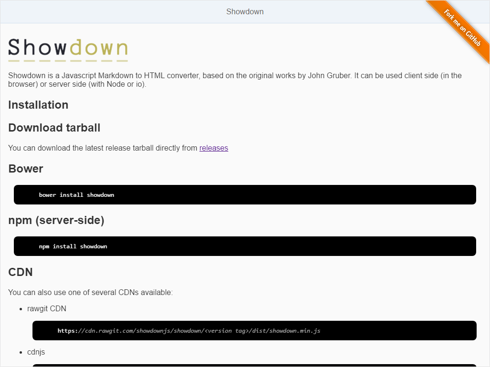

# Showdown

## [OpenUI5 Developer Blog](http://openui5.blogspot.com/2017/03/showdown.html)

> [UI5](http://openui5.org/) control to view [Markdown](https://en.wikipedia.org/wiki/Markdown) content inside your app using [Showdown](https://github.com/showdownjs/showdown) javascript library.

### [Online Demo (SAP HCP)](https://showdown-p1940953245trial.dispatcher.hanatrial.ondemand.com/index.html)




## Initialize

With JavaScript

``` js
new de.blogspot.openui5.showdown.control.Showdown({
	src : "../path/readme.md"
});
```

With XMLView

``` html
xmlns:sd="de.blogspot.openui5.showdown.control"
...
<sd:Showdown src="../path/readme.md" />
```

## Remarks
I did not mark it as a general control component, because i added the prettify dependency directly inside the control. I liked the prettify extension to easily highlight code inside Markdown and therefore it is enabled in my demo.  

The control should be used as a starting point to extend it to your needs.


## License

Showdown is released under the [Apache license](http://www.apache.org/licenses/). Have at it.
